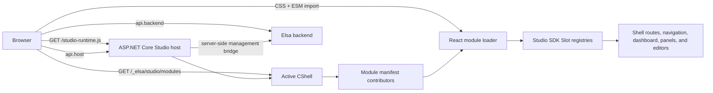

# Elsa Foundation Studio architecture tour

Elsa Foundation Studio is a modular React/Vite single-page application hosted by ASP.NET Core. The host composes backend features with CShells, discovers frontend module manifests from the active shell, and loads each accepted module as same-origin CSS and ESM. Modules register typed Contributions into host- or module-owned Slots through the Studio SDK.

This document is the canonical repository orientation guide. Follow the source links in the section you are investigating; the linked code remains authoritative for implementation details.

## System map

## Host and shell

[`Elsa.Studio.Web`](../src/Elsa.Studio.Web/Program.cs) is the composition root. It:

- builds the ASP.NET Core host;
- loads the active-shell definition from [`shells.json`](../src/Elsa.Studio.Web/shells.json);
- registers CShells feature assemblies and Nuplane package loading;
- exposes browser runtime configuration at `/studio-runtime.js`;
- maps Studio-owned APIs, active-shell APIs, CShell endpoints, static assets, and package assets; and
- falls back to `studio/index.html` for SPA deep links.

The React entry point is [`main.tsx`](../src/Elsa.Studio.Web/Client/src/main.tsx). [`App.tsx`](../src/Elsa.Studio.Web/Client/src/app/App.tsx) owns shell boot, authentication gating, manifest loading, client-side route selection, the host frame, and host-owned pages.

CShells controls which backend features are active for a shell. Nuplane can load additional packaged feature assemblies and refresh the runtime catalog. Enabling a feature makes its services, endpoints, and manifest contributors available; it does not automatically require that feature to contribute every kind of UI.

## Modules, manifests, and Contributions

A Studio module crosses two related boundaries:

1. A backend CShells feature registers services and endpoints and may contribute a [`StudioModuleManifest`](../src/Elsa.Studio.Core/Models/StudioModuleManifest.cs) through [`OnStudioModuleManifestsCollecting`](../src/Elsa.Studio.Core/Events/OnStudioModuleManifestsCollecting.cs).
2. The manifest points to frontend CSS and an ESM entry whose exported `register(api)` function adds Contributions to Studio SDK registries.

[`StudioModuleManifestProvider`](../src/Elsa.Studio.Api/Services/StudioModuleManifestProvider.cs) collects manifests from the active shell, sorts them deterministically, filters host-disabled modules and modules whose owning feature is inactive, and reports diagnostics. [`ActiveShellStudioApiEndpoint`](../src/Elsa.Studio.Web/ActiveShellStudioApiEndpoint.cs) exposes the boot manifest at `GET /_elsa/studio/modules` and the inspection-oriented registry at `GET /_elsa/studio/module-registry`.

In the browser, [`loader.ts`](../src/Elsa.Studio.Web/Client/src/app/loader.ts) checks host and SDK version compatibility, loads versioned styles, imports each ESM entry, and invokes `register(api)`. [`registry.ts`](../src/Elsa.Studio.Web/Client/src/app/registry.ts) creates the host and backend endpoint contexts plus the Slot registries defined by the [`ElsaStudioModuleApi`](../src/Elsa.Studio.Web/Client/src/sdk/index.ts).

Slots define accepted Contribution shapes, ownership, ordering, and local admission rules. Module Policy and Host Policy can further restrict availability. A representative full-stack path is the [Weather Forecast feature](../src/Elsa.Studio.Samples.WeatherForecast/WeatherForecastStudioFeature.cs) (whose `[StudioModule]` attribute declares the module manifest declaratively) and its frontend [`register` function](../src/Elsa.Studio.Samples.WeatherForecast/Client/src/module.tsx).

The domain vocabulary and governance model are maintained in [`CONTEXT.md`](../CONTEXT.md) and [ADR 0001](adr/0001-use-slots-and-contributions-for-studio-extensibility.md).

## Routing and navigation

Studio routing is client-side and registry-driven. ASP.NET Core serves the SPA fallback for browser deep links, while [`App.tsx`](../src/Elsa.Studio.Web/Client/src/app/App.tsx) tracks `window.location`, uses the History API, and selects a route Contribution for the current path.

The host owns a small set of shell-level pages such as Dashboard, module management, package feeds, theme management, and diagnostics. Modules add their routed UI through `api.routes` and add discoverability independently through `api.navigation`. A route therefore does not appear in navigation unless a navigation Contribution points to it. Feature-area Contributions can group owned routes and navigation without changing route ownership.

Route order and navigation order are deterministic. Contribution order and stable fallback keys, rather than module load order, decide presentation.

## API boundaries

The module API exposes two endpoint contexts:

- `api.host` targets the Studio origin. It is used for Studio-owned surfaces such as module discovery, module and feature management, theme management, Studio diagnostics, and server-side bridge endpoints.
- `api.backend` targets the browser-facing `Studio:BackendBaseUrl`, surfaced without secrets through [`StudioRuntimeScript`](../src/Elsa.Studio.Web/StudioRuntimeScript.cs) and read by [`runtime.ts`](../src/Elsa.Studio.Web/Client/src/app/runtime.ts). When no backend URL is configured, it resolves to the Studio origin. Server-side authentication and privileged relays use `Studio:BackendServerBaseUrl`, falling back to `Studio:BackendBaseUrl` for single-URL deployments.

Workflow, Secrets, and other Elsa-domain modules normally call their backend APIs through `api.backend`. Studio administration calls Studio-owned endpoints through `api.host`. Privileged backend host-control operations go through [`StudioBackendManagementBridge`](../src/Elsa.Studio.Web/StudioBackendManagementBridge.cs) or its related relays: the browser sends only the user credential, and Studio attaches the server-side management key on the Studio-to-backend call. The management key is never emitted in `/studio-runtime.js`.

Feature-owned APIs remain responsible for mapping and protecting their own server endpoints. Choosing `api.host` or `api.backend` establishes the destination and transport context; it is not an authorization decision.

## Authentication and authorization

Authentication is opt-in through `Studio:Auth:Enabled`.

When authentication is enabled:

1. [`studioAuth.tsx`](../src/Elsa.Studio.Web/Client/src/app/auth/studioAuth.tsx) creates one provider manager against the configured backend and gates the whole shell with `RequireAuth`.
2. [`backend.ts`](../src/Elsa.Studio.Web/Client/src/auth/backend.ts) negotiates the backend identity bootstrap and capabilities endpoints and drives the redirect/session/token flow.
3. Host and backend HTTP clients attach the user bearer and perform one refresh-and-retry on a `401`; SignalR connections use the same user token through an access-token factory. The transport is implemented in [`http.ts`](../src/Elsa.Studio.Web/Client/src/auth/transport/http.ts).
4. [`StudioBridgeAuth`](../src/Elsa.Studio.Web/StudioBridgeAuth.cs) validates browser bearers against the backend session endpoint and applies named read/manage permission policies to Studio host-control APIs. A missing or invalid session yields `401`; an authenticated user without a required permission yields `403`.

When authentication is disabled, the development/demo shell boots anonymously and Studio bridge policies intentionally allow anonymous access.

Protection is endpoint-specific. The client authentication boundary prevents unauthenticated users from rendering the enabled shell, and host-control APIs enforce server-side policies. Static assets, `/studio-runtime.js`, the SPA fallback, and the active-shell manifest endpoints do not currently carry an explicit authorization policy. Backend and module endpoints must enforce their own authorization; hiding a route, navigation item, or control in the UI is never a security boundary.

The provider-neutral, two-plane auth direction is recorded separately in the [authentication architecture ADR](../specs/002-auth-system/adr/0001-auth-architecture.md). That ADR describes the broader foundation strategy; the files linked above describe the protection currently implemented in this Studio host.

## Dashboard Slot and admission

Dashboard is the host-owned `studio.dashboard.widgets` Slot. It accepts workspace-summary Contributions that help a user understand what to know or do next.

A Dashboard Contribution should be admitted only when it:

- provides clear workspace-summary or next-action value;
- is relevant in the current user, tenant, feature, module, and runtime context;
- fits the Dashboard Slot rather than diagnostics, module administration, or a dedicated routed workbench;
- satisfies the Slot Owner's shape and ordering rules; and
- remains available after Module Policy and Host Policy are applied.

Accepted Contributions are ordered by explicit `order` and stable fallback values, never by module load order. Modules may contribute zero, one, or multiple Dashboard widgets. Dashboard Contributions are optional, and there is no one-widget-per-module rule. The host renders a valid empty state when no Dashboard widgets are registered.

See [ADR 0004](adr/0004-keep-dashboard-and-diagnostics-as-separate-slots.md) for the boundary between Dashboard summaries and Diagnostics signals.

## Where to go next

- To build or extend a module, start with the [SDK contract](../src/Elsa.Studio.Web/Client/src/sdk/index.ts) and a representative module close to the required shape.
- To change shell composition or package loading, start with [`Program.cs`](../src/Elsa.Studio.Web/Program.cs), [`shells.json`](../src/Elsa.Studio.Web/shells.json), and [`loader.ts`](../src/Elsa.Studio.Web/Client/src/app/loader.ts).
- To change navigation or routes, start with [`registry.ts`](../src/Elsa.Studio.Web/Client/src/app/registry.ts) and [`App.tsx`](../src/Elsa.Studio.Web/Client/src/app/App.tsx).
- To change API transport or authentication, start with [`runtime.ts`](../src/Elsa.Studio.Web/Client/src/app/runtime.ts), [`studioAuth.tsx`](../src/Elsa.Studio.Web/Client/src/app/auth/studioAuth.tsx), and [`StudioBridgeAuth.cs`](../src/Elsa.Studio.Web/StudioBridgeAuth.cs).
