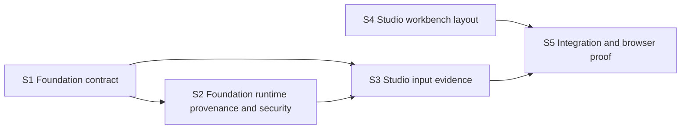

# Delivery Roadmap: Run Detail Input Evidence Workbench

## Dependency map

## Slices

### S1 — Foundation executable input-source contract

**Repository**: `elsa-workflows/elsa-foundation`
**Outcome**: Each per-publish Source Reference carries a frozen Authored Inputs Sidecar while the content-addressed executable exposes stable ReferenceKey identity and structured compiled bindings. Artifact hash remains purely behavioral.
**Proof**: Sidecar store/serialization/hash-invariance tests, inspector tests for supported binding kinds, and legacy forms.

### S2 — Foundation runtime evaluation provenance and security

**Repository**: `elsa-workflows/elsa-foundation`
**Depends on**: S1
**Outcome**: Input evidence carries ReferenceKey, replay-idempotent evaluation ID, phase, atomic sequence, sensitivity, and safe per-input failure metadata across invocation, bookmark resume, and parent completion. Source uses `workflow-publishing.read`; evidence uses `workflow-runtime.read`.
**Proof**: Runtime tests for propagation, replay deduplication, ordering, rematerialization, failure isolation, and the permission/redaction matrix.

### S3 — Studio paired input evidence

**Repository**: `elsa-workflows/elsa-foundation-studio`
**Depends on**: S1, S2
**Outcome**: Inputs are union rows with compact/expanded runtime/source views, evaluation history, compatibility/anomaly states, and arbitrary expression rendering fallback.
**Proof**: Pure derivation, type/contract, component, accessibility, and expression fallback tests.

### S4 — Studio full-height responsive Run workbench

**Repository**: `elsa-workflows/elsa-foundation-studio`
**Outcome**: Route-specific full-bleed shell allocation; no route scroll; Run-specific resizable desktop inspector; medium modal drawer; narrow focus mode; console-aware resizing without changing designer surfaces.
**Proof**: Layout/component tests and real-route resize checks.

### S5 — Integration, self-review, and release proof

**Repositories**: both
**Depends on**: S2, S3, S4
**Outcome**: Cross-repository contract is compatible, validation is green, and the real Run route is verified at supported sizes/security states.
**Proof**: Test/build/lint logs, browser evidence, completed checklist, and PR descriptions.

## Merge order

1. Foundation PR containing S1 and S2.
2. Studio PR containing S3 and S4 after the Foundation contract is consumable.
3. No automatic merge; maintainers review both PRs and merge Foundation first.
